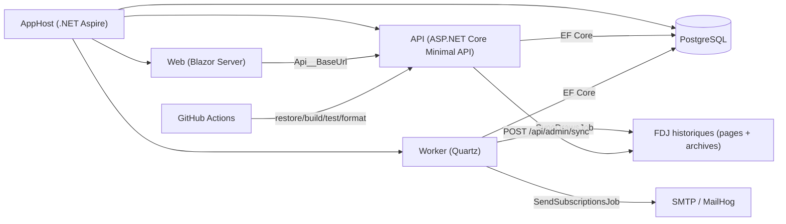

# Probabilités Loto & EuroMillions
Plateforme .NET de démonstration pour ingérer les tirages FDJ (Loto / EuroMillions) et exposer des statistiques, grilles et abonnements e-mail.

[](./.github/workflows/ci.yml)
[](./.github/workflows/deploy-manual.yml)
[](./LICENSE)

## Démo live
- URL de démo : `https://loto.arnaudwissart.fr`

## Ce que ça démontre
- Ingestion automatique des tirages Loto et EuroMillions depuis les historiques FDJ, avec découverte d’archives et parsing CSV/Excel tolérant.
- Planification Quartz côté worker avec deux jobs: `SyncDrawsJob` (cron par défaut `0 30 2 * * ?`) et `SendSubscriptionsJob` (cron par défaut `0 0/5 * * * ?`), timezone `Europe/Paris`.
- API Minimal ASP.NET Core avec endpoints statistiques, génération de grilles, newsletter et administration (`X-Api-Key`).
- Interface Blazor Server (MudBlazor) avec pages dédiées: `/statistiques`, `/grilles`, `/abonnement`, `/admin`.
- Persistance PostgreSQL via EF Core + migrations appliquées au démarrage (`Database:AutoMigrate=true` par défaut).
- Dispatch newsletter idempotent via contrainte unique `(SubscriberId, Game, DrawDate)` dans `mail_dispatch_history`.
- Observabilité complète: Serilog JSON, OpenTelemetry (traces/métriques), health checks PostgreSQL et SMTP optionnel.
- Qualité logicielle industrialisée: tests unitaires + intégration API/PostgreSQL (Testcontainers) + CI `restore/build/test/format`.

## Captures


## Architecture


Références de conception:
- Schéma base de données: [docs/schema-db.md](./docs/schema-db.md)
- ADR observabilité/admin/ingestion: [docs/adr/0001-observabilite-admin-ingestion.md](./docs/adr/0001-observabilite-admin-ingestion.md)

## Stack technique
- Runtime: .NET SDK `10.0.103` (fichier `global.json`) et projets `net10.0`.
- Back: ASP.NET Core Minimal API + Worker .NET avec Quartz `3.15.1`.
- Front: Blazor Server + MudBlazor `8.15.0`.
- Data: PostgreSQL (`postgres:17-alpine`) + EF Core `10.0.0` + Npgsql `10.0.0`.
- Ingestion FDJ: `HttpClient`, `HtmlAgilityPack 1.12.0`, `ExcelDataReader 3.8.0`.
- Observabilité: Serilog `10.x`, OpenTelemetry `1.14.0`, health checks applicatifs.
- Tests: xUnit `2.9.3`, `Microsoft.AspNetCore.Mvc.Testing 10.0.0`, `Testcontainers.PostgreSql 4.8.1`.
- Conteneurisation/orchestration: Docker Compose + AppHost .NET Aspire (`Aspire.Hosting.PostgreSQL 13.1.1`).

## Démarrage rapide (dev local)
Prérequis:
- Docker + Docker Compose
- .NET SDK `10.0.103` (si exécution hors conteneurs)

Option A (recommandée, stack complète via Compose):
```powershell
Copy-Item .env.example .env
docker compose up --build
```

Endpoints locaux:
- Web: `http://localhost:8080`
- API Swagger: `http://localhost:8081/swagger`
- API Health: `http://localhost:8081/health`
- MailHog: `http://localhost:8025`

Option B (orchestration locale via Aspire):
```powershell
dotnet user-secrets set "Parameters:postgres-password" "<POSTGRES_PASSWORD>" --project src/AppHost
dotnet run --project src/AppHost
```

Détails d’exploitation (home/self-hosted): [docs/RUNBOOK.md](./docs/RUNBOOK.md)

## Tests
Pipeline équivalent à la CI:
```powershell
dotnet restore ProbabilitesLotoEuroMillions.sln
dotnet build ProbabilitesLotoEuroMillions.sln --configuration Release --no-restore
dotnet test ProbabilitesLotoEuroMillions.sln --configuration Release --no-build
dotnet format ProbabilitesLotoEuroMillions.sln --verify-no-changes --no-restore
```

Couverture de tests du dépôt:
- Unitaires: `tests/UnitTests` (génération, règles métier, parsing FDJ, newsletter, scheduling).
- Intégration: `tests/IntegrationTests` (API + PostgreSQL via Testcontainers).
- E2E: TODO (non implémenté dans ce dépôt).

## Sécurité & configuration
Règles:
- Ne jamais committer `.env` ni `deploy/home.env`.
- Utiliser uniquement des placeholders dans les fichiers d’exemple.
- Protéger les endpoints admin (`X-Api-Key`) et `/admin` (HTTP Basic) avec des secrets forts.

Variables d’environnement principales:

| Variable | Usage | Exemple (placeholder) |
| --- | --- | --- |
| `POSTGRES_USER` | Compte PostgreSQL | `<DB_USER>` |
| `POSTGRES_PASSWORD` | Mot de passe PostgreSQL | `<DB_PASSWORD>` |
| `CONNECTIONSTRINGS__POSTGRES` | Chaîne de connexion explicite (home/prod) | `Host=postgres;Port=5432;Database=probabilites_loto;Username=<DB_USER>;Password=<DB_PASSWORD>` |
| `ADMIN_API_KEY` | Protection des endpoints `/api/admin/*` | `<ADMIN_API_KEY>` |
| `ADMIN_WEB_USERNAME` | Login HTTP Basic pour `/admin` | `<ADMIN_USER>` |
| `ADMIN_WEB_PASSWORD` | Mot de passe HTTP Basic pour `/admin` | `<ADMIN_PASSWORD>` |
| `PUBLIC_BASE_URL` | Base URL publique legacy (`Subscriptions`) | `https://demo.example.com` |
| `SUBSCRIPTIONS_TOKEN_SECRET` | Secret de signature des tokens abonnement legacy | `<LONG_RANDOM_SECRET>` |
| `MAIL__ENABLED` | Active/désactive les envois e-mail | `true` |
| `MAIL__FROM` | Adresse expéditeur | `no-reply@example.com` |
| `MAIL__FROMNAME` | Nom expéditeur | `Proba Loto` |
| `MAIL__BASEURL` | URL publique utilisée dans les liens d’e-mails | `https://demo.example.com` |
| `MAIL__SMTP__HOST` | Hôte SMTP | `smtp.example.com` |
| `MAIL__SMTP__PORT` | Port SMTP | `587` |
| `MAIL__SMTP__USESSL` | TLS SMTP | `true` |
| `MAIL__SMTP__USERNAME` | Login SMTP | `<SMTP_USERNAME>` |
| `MAIL__SMTP__PASSWORD` | Secret SMTP | `<SMTP_PASSWORD>` |
| `MAIL__SCHEDULE__SENDHOURLOCAL` | Heure locale d’ouverture de fenêtre d’envoi | `8` |
| `MAIL__SCHEDULE__SENDMINUTELOCAL` | Minute locale d’ouverture de fenêtre d’envoi | `0` |
| `MAIL__SCHEDULE__TIMEZONE` | Timezone de planification | `Europe/Paris` |
| `MAIL__SCHEDULE__FORCE` | Bypass ponctuel de la fenêtre horaire | `false` |
| `HEALTHCHECKS_SMTP_ENABLED` | Active le check SMTP dans `/health` | `true` |
| `CORS_ALLOWED_ORIGIN_1` | Origine CORS additionnelle | `https://web.example.com` |
| `JOBS_SYNC_DRAWS_RUN_ON_STARTUP` | Exécute la synchro des tirages au démarrage worker (home) | `true` |
| `JOBS_SEND_SUBSCRIPTIONS_RUN_ON_STARTUP` | Exécute le dispatch newsletter au démarrage worker (home) | `false` |

Mécanisme planifié réel:
- `SyncDrawsJob`: cron par défaut `0 30 2 * * ?` (`Jobs:SyncDraws`).
- `SendSubscriptionsJob`: cron par défaut `0 0/5 * * * ?` (`Jobs:SendSubscriptions`).
- Les envois newsletter respectent le calendrier métier: Loto (lundi/mercredi/samedi), EuroMillions (mardi/vendredi).

## Licence
Ce projet est sous licence [MIT](./LICENSE).
