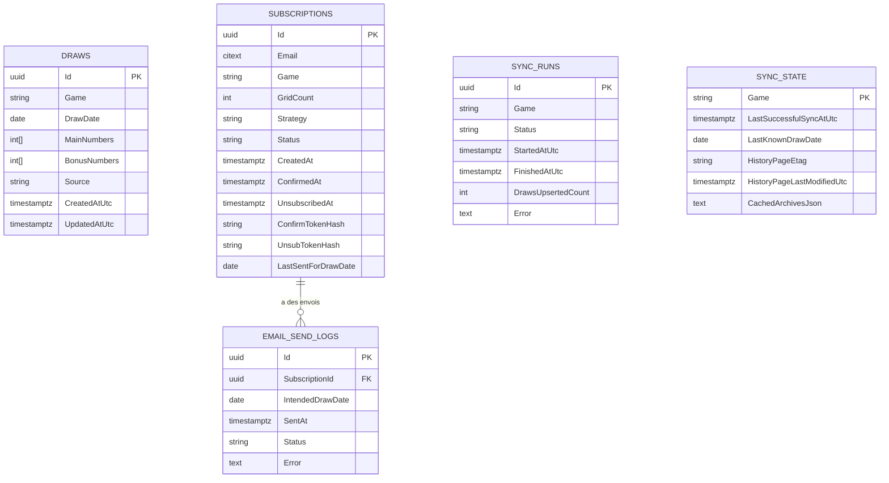

# Schema de base de donnees

Diagramme simplifie (PostgreSQL):

Notes:
- `draws` est unique par `(Game, DrawDate)`.
- `sync_state` contient l'etat courant par jeu (dont cache HTTP FDJ).
- `email_send_logs` trace les envois effectifs et les echecs par abonnement.
